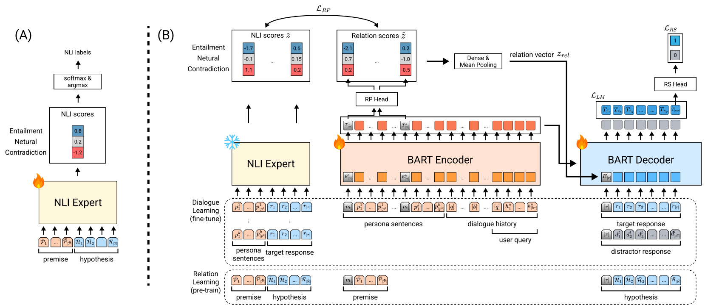

# MoCoRP: Modeling Consistent Relations between Persona and Response for Persona-based Dialogue
This is the official repository of our `journal` paper.



## Dataset
### ConvAI2
You can download [ConvAI2 dataset](https://parl.ai/projects/convai2/) through the ParlAI library link.

Download `train_self_original.txt` and `valid_self_original.txt`, and place them in the `data/convai2` directory.


### MPChat
You can download [MPChat dataset](https://github.com/ahnjaewoo/MPCHAT).

Download `mpchat_nrp.json`, and place it in the `data/mpchat` directory.

Note that we split the `mpchat_nrp.json` dataset into `train_mpchat_nrp.json`, `valid_mpchat_nrp.json`, and `test_mpchat_nrp.json` for training, validation, and testing, respectively.


### Dialogue NLI
Additionally, we use [Dialogue NLI dataset](https://wellecks.com/dialogue_nli/) for training NLI expert.

Download `dialogue_nli_train.jsonl`, `dialogue_nli_dev.jsonl`, and `dialogue_nli_test.jsonl`, and place them in the `data/dialogue_nli` directory.


## Model training and inference
Please check each directory (`MoCoRP` and `MoCoRP LLM`) for model training and inference per each task.


## Have any questions?
Please contact Kyungro Lee at lkr981147 at gist.gm.ac.kr


## Citation
Please cite our work if you found the resources in this repository useful:
```bib
bib
```
